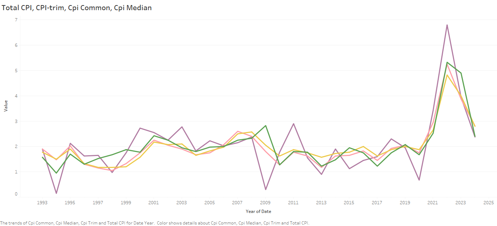

# Understanding Inflation in Canada: Affordability, Financial Strain, and Economic Stability

*A Decision Intelligence Analysis of Inflation in Canada*

*Author: Adaobi Obua*

## Executive Summary
This study analyzes inflation trends in Canada through the lens of Consumer Price Index (CPI) growth, wage growth reports, housing affordability, and monetary policies. Using comprehensive datasets from Statistics Canada, the Bank of Canada, and CMHC, we examine how inflation affects affordability in different economic sectors and whether current monetary policies are effective in maintaining price stability. By analyzing these datasets, this research aims to provide insights into the long-term economic implications of inflation in Canada and offer data-driven recommendations for policymakers, businesses, and individuals.

[Read detailed background information here](Background.md)

## Key Performance Indicators (KPIs)

### Consumer Price Index (CPI) Growth Rate

The Consumer Price Index (CPI) is a vital Key Performance Indicator (KPI) for understanding inflation trends and their impact on economic stability in Canada.

<!-- consider writing a brief paragraph like the one above ^^ that emphasizes the potential value of looking at this measurement. We want to convey awareness of the business value of this measure and our ability to take a macro view -->

Summary details:

- Measures the percentage change in the Consumer Price Index (CPI) over a specified period (monthly or yearly).   
- CPI is the primary indicator of inflation, showing how the average price level of a basket of goods and services changes over time.

### Core Inflation Rate
- Inflation rate that excludes volatile items such as food and energy prices.
- Provides a more stable view of inflation trends by removing short-term price fluctuations.

### Purchasing Power of the Canadian Dollar
 - Measures how much the value of the Canadian dollar has changed over time in terms of its ability to purchase goods and services.
- Helps assess the real impact of inflation on consumers and businesses.

### Wage Growth vs. Inflation Rate
- Compares the growth in average wages to the inflation rate to determine if wages are keeping up with rising costs.
- If wages grow slower than inflation, consumers lose purchasing power, leading to reduced economic well-being.

- This graph details the average CPI determined from all goods from 1992 to 2025.

- This chart details all product categories used to determine annual average CPI.

-  This graph details the monthly average price of selected food items from 2017 to 2024. 

- This graph details the average wage for all industries from 1997 to 2024.

- This graph shows change in inflation measures Total CPI, CPI-trim, CPI-Common, and CPI-Median from 1992-2025.

# Exploratory Data Analysis

